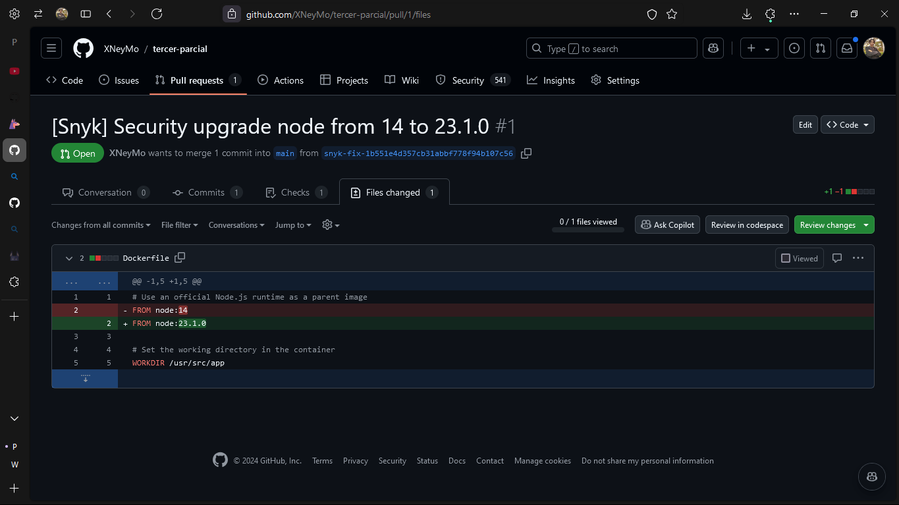

# INTEGRACIÓN CONTINUA CON REVISIÓN DE SEGURIDAD

## Integrantes

- Neyan Manuel Montes Abad (T00064020)
- Michael Andrés Taboada Naranjo (T00064965)

## Introducción

Este parcial corresponde al desarrollo del tutorial [Automating Dockerfile Vulnerability Scanning in GitHub Actions Using Snyk and CodeQL](https://shrihariharidas73.medium.com/automating-dockerfile-vulnerability-scanning-in-github-actions-using-snyk-and-codeql-afa03943985f) empleando la herramienta de analisis de codigo llamada [Snyk](https://snyk.io/) para analizar las vulnerabilidades que podamos encontrar en el desarrollo de nuestros proyectos.

## Desarrollo

### Paso 1: Crear una cuenta de GitHub

Para poder llevar a cabo esta practica, logicamente necesitamos tener una cuenta en [GitHub](https://github.com) ya que es donde tendremos el repositorio que usaremos importarlo en Snyk y analizar vulnerabilidades de nuestro codigo.

### Paso 2: Crear un repositorio en GitHub

Cabe aclarar que para realizar esto, debemos crear un repositorio que tenga visibilidad publica, ya que de lo contrario, el [Workflow]() encargado de los procesos dentro de los repositorios de GitHub no podrá realizar el analisis de vulnerabilidades, algo de lo que nos percatamos posteriormente ya que el [Code Scanning]() de GitHub solo puede ser gestionado en repositorios publicos o de [Organizaciones]().


### Paso 3: Crear una cuenta en Snyk

Para poder realizar el analisis de vulnerabilidades, ademas de la cuenta de GitHub y el repositorio en publico o de Organización, tambien necesitamos una cuenta en Snyk, para ello, simplemente vamos a la plataforma de [Snyk](https://snyk.io/) y la creamos. Ademas de ello, enlazaremos esta cuenta con nuestro GitHub para que pueda acceder a los repositorios e importar en el que estamos realizando el analisis de vulnerabilidades de codigo.

Aquí podemos ver un ejemplo, nos dirigiremos al apartado de integraciones y seleccionamos el de GitHub.


### Paso 4: Enlazamos nuestra cuenta de Snyk con el repositorio de GitHub

Para esto, nos dirigiremos a la configuración de nuestra cuenta en Snyk y utilizamos el token que nos dan en el apartado General.


Luego de copiar este token nos dirigiremos al respositorio que creamos, especificamente al apartado de Configuración.


Buscaremos la sección de Secretos y Variables, aquí elegiremos el de Acciones y crearemos un secreto el cual llamaremos `SNYK_TOKEN` con el valor que habiamos copiado de nuestra cuenta de Snyk.


### Paso 5: Creamos el archivo Dockerfile

En nuestro repositorio crearemos un archivo Dockerfile con la siguiente información la cual es exactamente igual al tutorial.

```Dockerfile
# Use an official Node.js runtime as a parent image
FROM node:14

# Set the working directory in the container
WORKDIR /usr/src/app

# Copy package.json and package-lock.json to the working directory
COPY package*.json ./

# Install app dependencies
RUN npm install

# Copy the rest of the application code to the working directory
COPY . .

# Expose the port the app runs on
EXPOSE 3000

# Define the command to run the application
CMD ["npm", "start"]
```

### Paso 6: Configuramos nuestro Workflow

En este caso, el tutorial nos indica ir al apartado de acciones y buscar un Workflow especifico de Snyk, sin embargo, al momento de realizar esta documentación y la practica, esa acción no se encuentra disponible, por ello, en caso tal de que la busqueda no les de resultados a la configuración de la acción, simplemente crearán una carpeta `.github/workflows`, y dentro de ella pondrán un archivo `.yml` que será el encargado de ejecutar la accion con las especificaciones que contiene.

El archivo original contiene lo siguinete:

```yml
name: Snyk Container 
on: push
jobs:
  snyk:
    runs-on: ubuntu-latest
    steps:
    - uses: actions/checkout@v2
    - name: Build a Docker image
      run: docker build -t your/image-to-test .
    - name: Run Snyk to check Docker image for vulnerabilities
      continue-on-error: true
      uses: snyk/actions/docker@master
      env:
        SNYK_TOKEN: ${{ secrets.SNYK_TOKEN }}
      with:
        image: your/image-to-test
        args: --file=Dockerfile
    - name: Upload result to GitHub Code Scanning
      uses: github/codeql-action/upload-sarif@v2
      with:
        sarif_file: snyk.sarif
```

No obstante, no funcionará debido a que el codigo se encuentra desactualizado, por ello, realizamos unas modificaciones para que se ejecutara sin ningun error:

```yml
name: Snyk Container
on: push

jobs:
  snyk:
    permissions:
      actions: read
      contents: read
      security-events: write
    
    runs-on: ubuntu-latest
    
    steps:
      - name: Checkout code
        uses: actions/checkout@v3

      - name: Build a Docker image
        run: docker build -t your/image-to-test .

      - name: Run Snyk to check Docker image for vulnerabilities
        continue-on-error: true
        uses: snyk/actions/docker@master
        env:
          SNYK_TOKEN: ${{ secrets.SNYK_TOKEN }}
        with:
          image: your/image-to-test
          args: --file=Dockerfile

      - name: Post process snyk sarif file  
        run: |
          sed -i 's/"security-severity": "null"/"security-severity": "0"/g' snyk.sarif

      - name: Upload result to GitHub Code Scanning
        uses: github/codeql-action/upload-sarif@v3
        with:
          sarif_file: snyk.sarif
```

En este caso, agregamos los permisos para que CodeQL, el cual es el apartado de GitHub que se actualizará luego del analisis de vulnerabilidades pueda leer los resultados optenidos del mismo.

Igualmente se añadió un apartado de Post-Procesamiento del archivo `.sarif` generado por Snyk ya que hay parametros del `security-severity` dentro de ese mismo archivo que tienen un valor `null`, lo cual genera conflicto en la lectura de `.sarif` por parte de GitHub.

### Paso 7: Guardar todos los archivos y realizar commit en el repositorio

Una vez tengamos nuestro archivo `Dockerfile` y el archivo `.github/workflows/*.yml`, haremos commit de ellos y un push para guardarlos en el repositorio de la plataforma de GitHub, resultando esto, podremos ir al apardado de Acciones para ver la ejecución del archivo `.yml` y analizar los posibles errores.

Pero si llegaron hasta este paso justo como se indica en todo este README, deberia funcionarles igual que a nosotros.


### Paso 8: Verificar las vulnerabilidades en la sección de Seguridad

Una vez obtengamos el resultado en positivo de la ejecución anterior, podremos ir al apartado de seguridad dentro de nuestro repositorio de GitHub en el que encontraremos lo siguiente


Estando aquí, simplemente nos dirigimos a la sección de Escaneo de Codigo en el que veremos dichos resultados.


Ahí podremos observar todas las vulnerabilidades que tiene nuestro codigo, igualmente realizar diferentes filtros para buscar algo en especifico.

### Paso 9: Verificación en Snyk

Al igual que en GitHub, si nos vamos a la plataforma de Snyk podremos encontrar los resultados de la evaluación.


Cada una de las etiquetas corresponde a una categoria de vulnerabilidad segun el riesgo o severidad de la misma. Al irnos al archivo `Dockerfile` podremos encontrar lo siguiente:


Y es que, Snyk no solo es util para el analisis de vulnerabilidades, sino que tambien puede brindar soluciones para las mismas al abrir Pull Request en nuestros respositorios de manera automatica, en este caso nos recomienda utilizar una versión mas avanzada de Node, pasando así de tener 530 vulnerabilidades a solamente 166.

## Aclaraciones y Conclusiones Finales

Hay que tener en cuenta que este metodo no es perfecto, en este caso, al realizar la Pull Request automatica que nos recomienda Snyk, podremos observar lo siguiente:


Lo que estamos viendo es que hubo un error en la ejecución de la Pull Request, por lo que no es viable dicha solución, esto es debido al cambio que realizó en el `Dockerfile`.



En este caso, si, actualizó la versión de Node en el `Dockerfile`, y precisamente ese es el problema, ya que la configuración del resto del archivo debe ir acorde a la versión, ademas de las modificaciones necesarias de nuestro `.yml`.


Asi que debemos de tener muy en cuenta la compatibilidad de las tecnologias que utilizamos y revisar muy bien las recomendaciones dadas por la plataforma de Snyk
